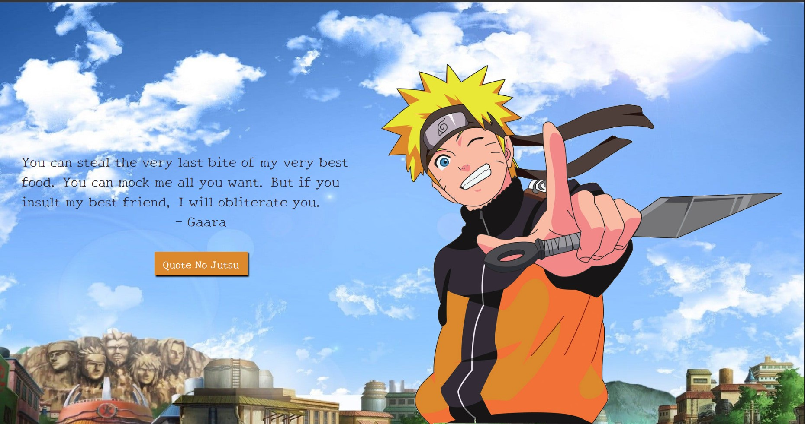

# Naruto Quotes 👍🏻

<p align="center">

</p>



## Project Description

Website developed to DIO's Bootcamp TQI Fullstack developer. It is the client of a super cool site that shows quotes from Naruto anime!

## How to run it locally

### Server

Go to this repository: https://github.com/celso-henrique/naruto-quotes-client and follow the instructions to run it.

### Install

Clone this repository and install it dependencies with this command:

```
 npm install
```

### Running

Run the application with npm start command, it will start the app on localhost:3000:

```
 npm start
```

## :hammer: Project Functionalities

- `Functionality 1`: Renders the Layout
- `Functionality 2`: Get a quote from the server
- `Functionality 3`: Renders the quote

## ✔️ Technologies and techniques used

- `REACT`
- `Mocks`
- `Unity tests`
- `Styled Components`
